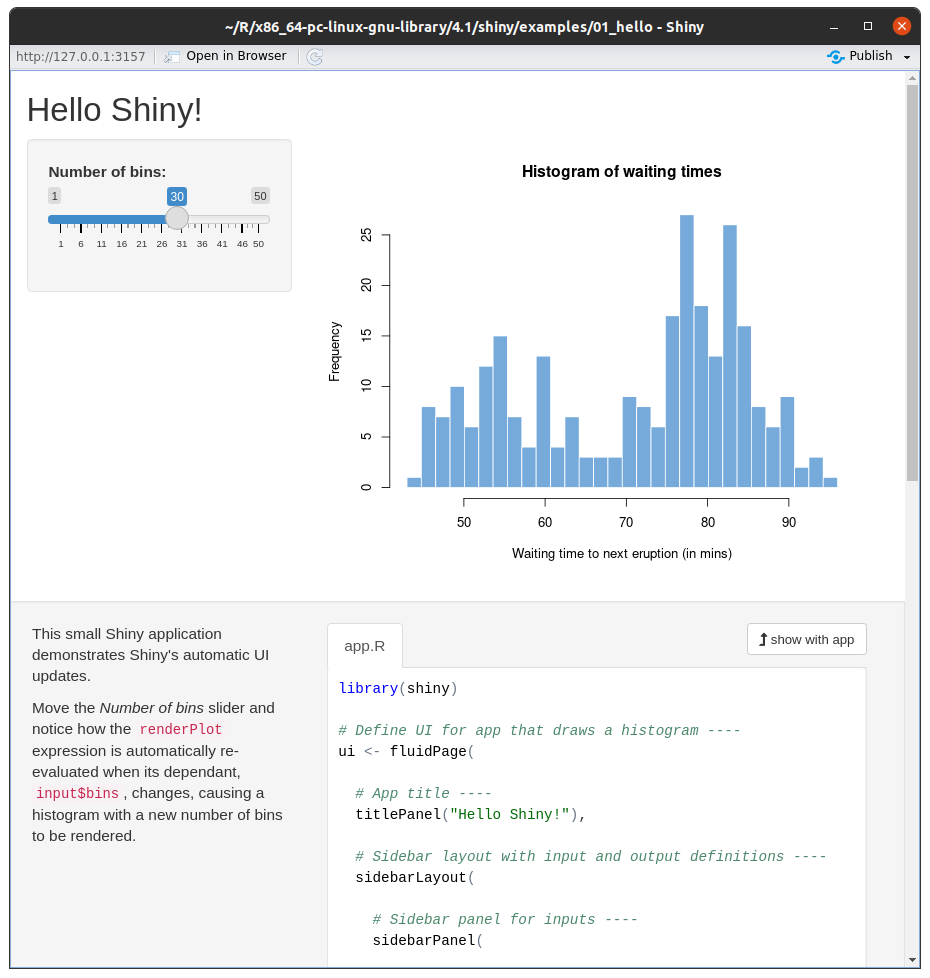
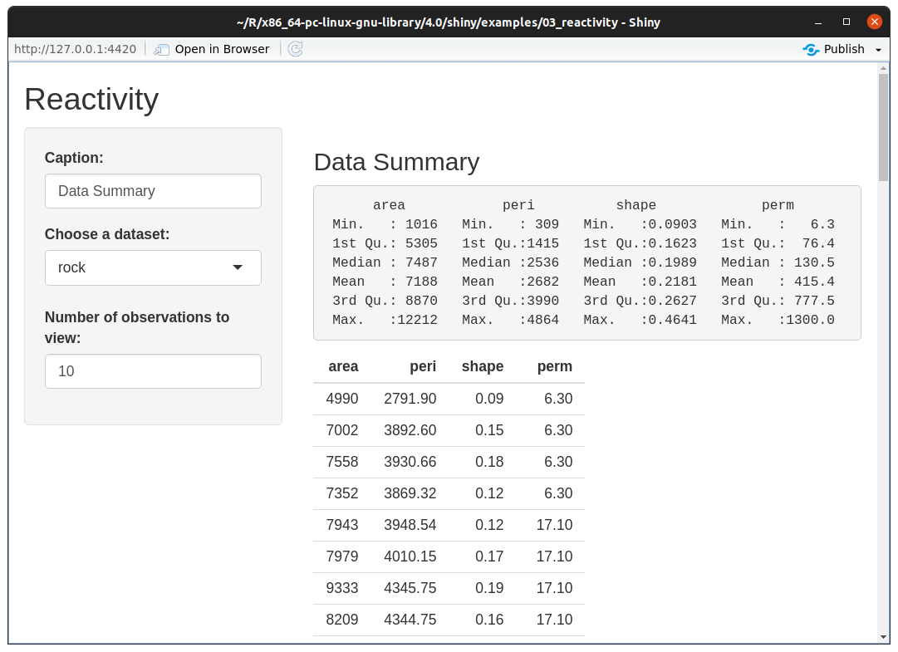
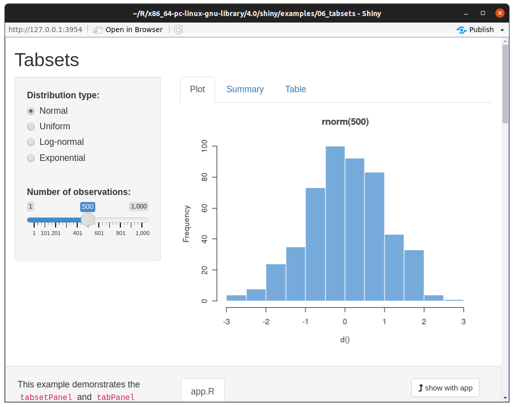
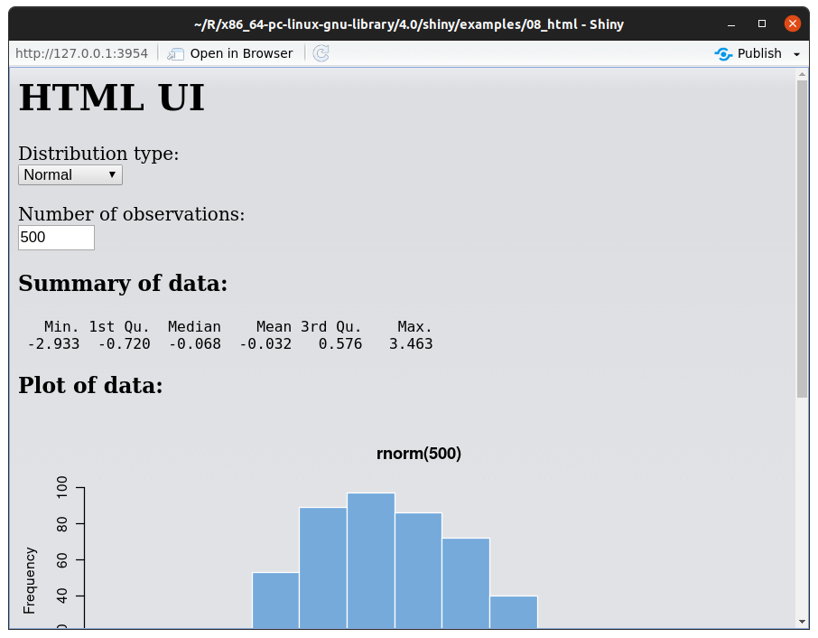
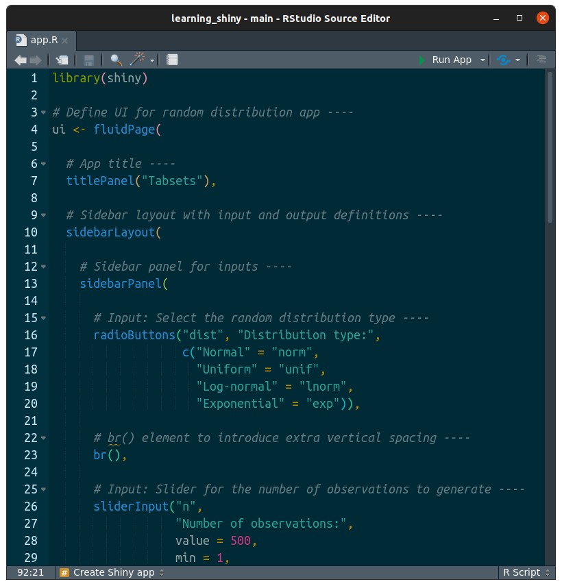
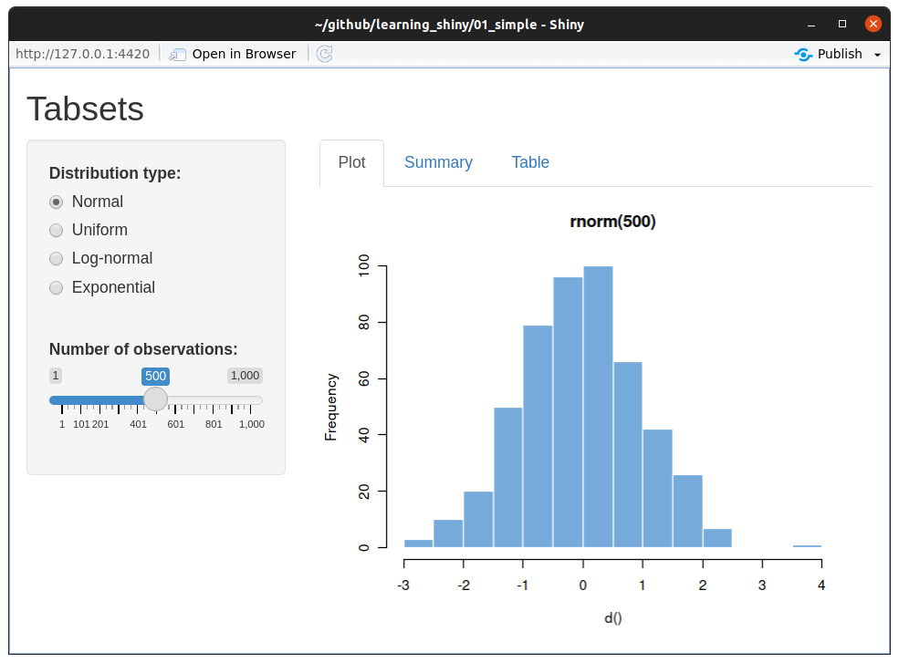

```{r setup, include=FALSE}
knitr::opts_chunk$set(echo = TRUE)
```

**Outline:**

* [First look at shiny apps](#first-look-at-shiny-apps)
* [First steps in editing shiny](#first-steps-in-editing-shiny)
  * [Task description](#task-description) 

# First look at shiny apps

In this exercise we will get more acquainted with Shiny apps. We will start by loading `shiny` package and looking at examples included in the package.

```{r}
library(shiny)
runExample()
```

As we see there are many examples we can look at, let's start with the simplest ones. When you run the following command, the example app should open in a new window and you should see the following output.

```{r eval=FALSE}
runExample("01_hello")
```

```{r echo=FALSE}
message("Listening on http://127.0.0.1:XXXX")
```

```{r, echo=FALSE, out.width="50%"}

```

You can open it in your browser by clicking `Open in Browser` button at the top of the window. You can stop the app by closing the window (or pressing `Esc` key when in the Console).

Now, try couple more.

To explore the reactivity more, try the 3rd example.

```{r, eval=FALSE}
runExample("03_reactivity")
```

```{r, echo=FALSE, out.width="50%"}

```

To see how we can arrange content let's explore tabsets.

```{r, eval=FALSE}
runExample("06_tabsets")
```

```{r, echo=FALSE, out.width="50%"}

```

And to explore how we 'stylize' the app - look at the html example.

```{r, eval=FALSE}
runExample("08_html")
```

```{r, echo=FALSE, out.width="50%"}

```

# First steps in editing shiny

This exercise is based on tabsets example from `shiny` package. I copied the code of the app into the `app.R` file.

```{r, echo=FALSE, out.width="50%"}

```

You can run the app by opening the app.R file and press `Run App` button in the upper right corner of your script window.

It is equivalent to running `shiny::runApp("path/to/app")` in the console. Which is what RStudio will do for you.

```{r, eval=FALSE}
shiny::runApp('01_simple')
```

```{r, echo=FALSE}
message("Loading required package: shiny")
message("Listening on http://127.0.0.1:XXXX")
```


```{r, echo=FALSE, out.width="50%"}

```

## Task description

Your task is to edit couple things in the app.

### Allow users to control number of bins

Add the slider, or other input, to allow users to control of number of bins in the histogram. 

*Note:* The bins argument in baseR `hist` is called `breaks`.

```{r, fig.height=5, fig.width=10, out.width="65%"}
dist <- rnorm(1000)
par(mfrow = c(1,2))
hist(dist, main = "Histogram with 10 bins", breaks = 10)
hist(dist, main = "Histogram with 50 bins", breaks = 50)
```

### Change the output in the `Summary` tab

Change the output in `Summary` tab such that instead of `verbatimTextOutput()` with the output of console it will be a nice text - either a `textOutput()` or `htmlOutput()`. Something along the lines of:

> All observations fall within the -2.955 - 3.03 range with mean equal to -0.073. Median is equal to -0.112 with 1st and 3rd quartiles at -0.711 and 0.606, respectively.

You can create the above text with glue.

```{r}
library(glue)
summary_vec <- summary(dist)
glue("All observations fall within the {summary_vec['Min.']} - {summary_vec['Max.']} range")
```

You can also add native html to the text when you use `htmlOutput()`. It will be render similiarly as the following string by `HTML()` function.

```{r}
HTML("This is <b>bold</b> and this is <mark>marked</mark>!")
```


Good luck! :) 

And remember to ask for help if you need it.