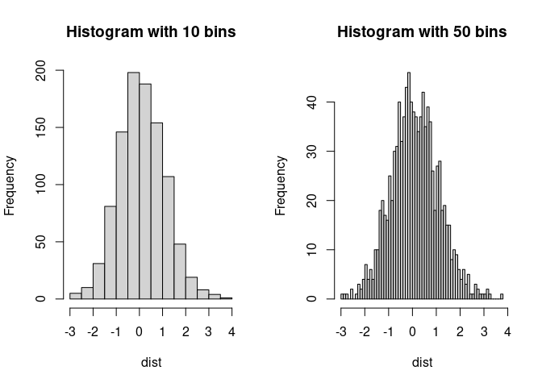

First steps - exercise
================

# First look at shiny apps

In this exercise we will get more acquainted with Shiny apps. We will
start by loading `shiny` package and looking at examples included in the
package.

``` r
library(shiny)
runExample()
```

    ## Valid examples are "01_hello", "02_text", "03_reactivity", "04_mpg", "05_sliders", "06_tabsets", "07_widgets", "08_html", "09_upload", "10_download", "11_timer"

As we see there are many examples we can look at, let’s start with the
simplest ones. When you run the following command, the example app
should open in a new window and you should see the following output.

``` r
runExample("01_hello")
```

    ## Listening on http://127.0.0.1:XXXX

You can open it in your browser by clicking `Open in Browser` button at
the top of the window. You can stop the app by closing the window (or
pressing `Esc` key when in the Console).

Now, try couple more.

To explore the reactivity more, try the 3rd example.

``` r
runExample("03_reactivity")
```

To see how we can arrange content let’s explore tabsets.

``` r
runExample("06_tabsets")
```


And to explore how we ‘stylize’ the app - look at the html example.

``` r
runExample("08_html")
```


# First steps in editing shiny

This exercise is based on tabsets example from `shiny` package. I copied
the code of the app into the `app.R` file.


You can run the app by opening the app.R file and press `Run App` button
in the upper right corner of your script window.

It is equivalent to running `shiny::runApp("path/to/app")` in the
console. Which is what RStudio will do for you.

``` r
shiny::runApp('01_simple')
```

    ## Loading required package: shiny

    ## Listening on http://127.0.0.1:XXXX


## Task description

Your task is to edit couple things:

-   add the slider or other input to include the change the control of
    number of bins on the plot in your app.

*Note:* The bins argument in baseR `hist` is called `breaks`.

``` r
dist <- rnorm(1000)
par(mfrow = c(1,2))
hist(dist, main = "Histogram with 10 bins", breaks = 10)
hist(dist, main = "Histogram with 50 bins", breaks = 50)
```

<!-- -->

-   change the output in `Summary` tab. You want your output to be text.
    Something along the lines of:

> All observations fall within the -2.955 - 3.03 range with mean equal
> to -0.073. Median is equal to -0.112 with 1st and 3rd quartiles at
> -0.711 and 0.606, respectively.

You can create the above text with glue.

``` r
library(glue)
summary_vec <- summary(dist)
glue("All observations fall within the {summary_vec['Min.']} - {summary_vec['Max.']} range")
```

    ## All observations fall within the -2.98400526442954 - 3.72521717664455 range

Good luck! :)

And remember to ask for help if you need it.
