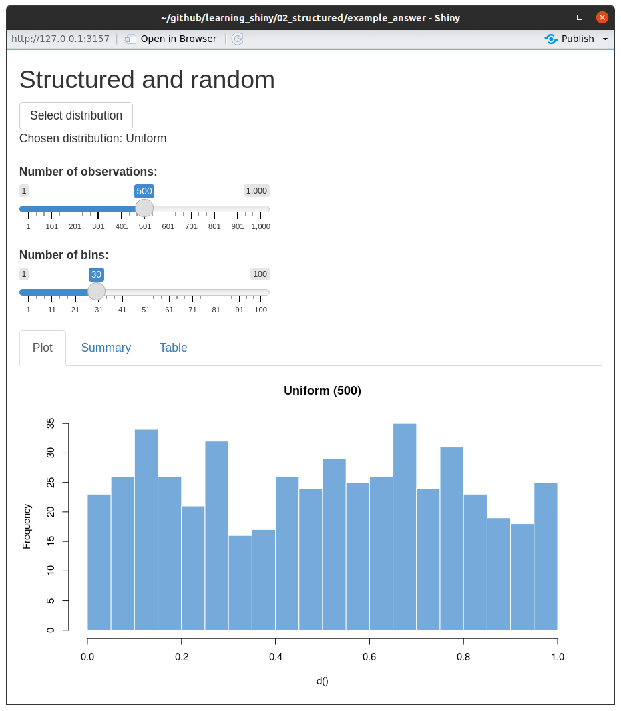

Structured app
================

This exercise explore structuring the shiny app code and mainlining a
more manageable code base by splitting the elements into modules.

**Outline**:

-   [Structure of Shiny App
    directory](#structure-of-shiny-app-directory)
-   [Structured example](#structured-example)
-   [Exercise description](#exercise-description)

# Structure of Shiny App directory

Typical directory structure of an app.

``` bash
app_name
├── app.R
├── DESCRIPTION # optional
├── R/ # optional
├── Readme.md # optional
└── www/ # optional
```

## Directory

The app is stored in the directory with its name: `app_name`. To run the
app we can run the following command in the console. `shiny` will then
run your app by executing the `app.R` (or `server.R` and `ui.R`) and all
`.R` files in the `R/` directory.

``` r
shiny::runApp("path/to/app_name")
```

## `app.R`

It is the only necessary file for your app to run. In earlier versions
of `shiny` the file would be split into two: `server.R` & `ui.R` and
that structure is still supported. You can read more about differences
between those two approaches, and more on the directory structure
[here](https://shiny.rstudio.com/articles/app-formats.html).

## `R/`

The `R` directory contains the files that will be sourced, without you
having to source them, when your app starts.

> As of Shiny version 1.3.2.9001, any .R files found in an R/ directory
> adjacent to your app will be automatically loaded when your app
> starts. Just like R packages, only the files at the top level of R/
> are considered; nested directories are ignored. Files in this
> directory are sourced in alphabetical order and any variables,
> functions, or modules they create are available to be used in your
> app.R, ui.R, or server.R files.

From [here](https://shiny.rstudio.com/articles/app-formats.html).

## `Readme.md` and `DESCRIPTION`

Those files are optional and can be used to share more information with
the audience of your app, as well as in showcase mode. In the
`DESCRIPTION` file you can specify the author, mode (showcase or
normal), license and so on. `Readme.md` will populate the app
description field. To check this out run the following command and check
the files in the `structured_example` sub directory.

``` r
shiny::runApp("structured_example/")
```

## `www`

This is an optional directory to share with a browser. Can contain
images, css and java script files to extend and customize the Shiny app.

# Structured example

Let’s consider a simple example in `structured_example` sub directory.

The `app.R` is very short and contains calls to `counter` module and
`counterButton` that are not specified in the file. As mentioned before,
the `.R` scripts contained in `R` sub directory will be executed when
the app is run and therefore there is no need to include a call to
`source("R/counter.R")`.

``` r
library(shiny)

ui <- fluidPage(
  counterButton("counter1", "Counter #1")
)

server <- function(input, output, session) {
  callModule(counter, "counter1")
}

shinyApp(ui, server)
```

`counter` module and `counterButton` are defined in the `counter.R` file
in the `R` sub directory.

``` r
counterButton <- function(id, label = "Counter") {
  ns <- NS(id)
  tagList(
    actionButton(ns("button"), label = label),
    verbatimTextOutput(ns("out"))
  )
}

counter <- function(input, output, session) {
  count <- reactiveVal(0)
  observeEvent(input$button, {
    count(count() + 1)
  })
  output$out <- renderText({
    count()
  })
  count
}
```

Check out the app in the `structured_app` directory and make sure it is
working. Run the following from within the `02_structured` directory, or
open `app.R` file and run it using `Run App` button in R Studio.

``` r
shiny::runApp("structured_example/", display.mode = "normal")
```


While in this example it might not look needed, if you would create a
large app, storing each part in a separate module (and file) might a be
good idea to keep the code easier to maintain.

# Exercise description

Run the exercise app and explore it for a moment. Is everything working
as it should?

``` r
shiny::runApp("exercise/")
```

## Your task

Your task is to 2-fold:

### fix the `Summary` tab

There is a mistake somewhere in the `button.R` file. Inspect the
`random_button_ui` function and fix the mistake.

### the button

There is code missing inside the `random_button_server` function.

``` r
# initialise reactive value and set a default
random_dist <- reactiveVal(distributions[1])

# update the value, hint: *sample* from the available distributions
observeEvent(input$button, {
  
  ### your code goes here ###
  
})
```

Let me remind you how the equivalent code looks in the simple counter
example:

``` r
count <- reactiveVal(0)

observeEvent(input$button, {
  
  count(count() + 1)
  
})
```

Do you know what do you need to do? I hope the clues are enough to help
you but please remember to ask for help if you need it!

And this is how the ready app can look like.


