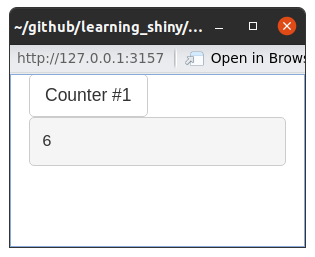

Structured app
================

# Structure of Shiny app directory

Typical directory structure of an app.

``` bash
app_name
├── app.R
├── DESCRIPTION
├── R/
├── README
└── www/
```

## Directory

`app_name` is the name of the directory and app name. To run the app you
can run the following command in the console.

``` r
shiny::runApp("path/to/app_name")
```

## `app.R`

Inside that directory has to be the only required file - `app.R`. In
this example it will have the following content.

``` r
library(shiny)

ui <- fluidPage(
  counterButton("counter1", "Counter #1")
)

server <- function(input, output, session) {
  callModule(counter, "counter1")
}

shinyApp(ui, server)
```

We are calling a `counter` module and `counterButton` that are not
specified in the `app.R` file. That’s because they are defined
`counter.R` file in the `R` sub directory. Note that we don’t have to
`source("R/counter.R")` file.

## `R/`

The `R` directory contains the files that will be sourced, without you
having to source them, when your app starts.

> As of Shiny version 1.3.2.9001, any .R files found in an R/ directory
> adjacent to your app will be automatically loaded when your app
> starts. Just like R packages, only the files at the top level of R/
> are considered; nested directories are ignored. Files in this
> directory are sourced in alphabetical order and any variables,
> functions, or modules they create are available to be used in your
> app.R, ui.R, or server.R files.

From [here](https://shiny.rstudio.com/articles/app-formats.html)

As mentioned above, in our example we have `counter.R` file in the `R`
sub directory in which we define `counter` module and `counterButton`.

``` r
counterButton <- function(id, label = "Counter") {
  ns <- NS(id)
  tagList(
    actionButton(ns("button"), label = label),
    verbatimTextOutput(ns("out"))
  )
}

counter <- function(input, output, session) {
  count <- reactiveVal(0)
  observeEvent(input$button, {
    count(count() + 1)
  })
  output$out <- renderText({
    count()
  })
  count
}
```

## `README` and `DESCRIPTION`

However it is a good practice to contain those, they are not required.

## `www`

This is an optional directory to share with a browser. Can contain
images, css and java script files to extend and customize the Shiny app.

# Exercise description

First, check out the app in the `structured_app` directory. Run the
following from within the `02_structured` directory, or open `app.R`
file and run it using `Run App` button in R Studio.

``` r
shiny::runApp("structured_app/")
```

You should see the following pop up with an app.

``` r

```

<!-- -->

Right now, it only has one button and a text output with the number of
times user has pressed it.

## Your task

Your task is to:

-   use the **code from the previous example and clean it up** -
    i.e. move the code into module(s) and corresponding R file(s)
-   modify **button** from structured example, such that instead of
    choosing a distribution or counting number of times it is pressed,
    after each press it will **randomly choose a distribution** and
    refresh the content of the app.

This is how the ready app can look like.

``` r
knitr::include_graphics("graphics/structured_app_answer.png")
```


