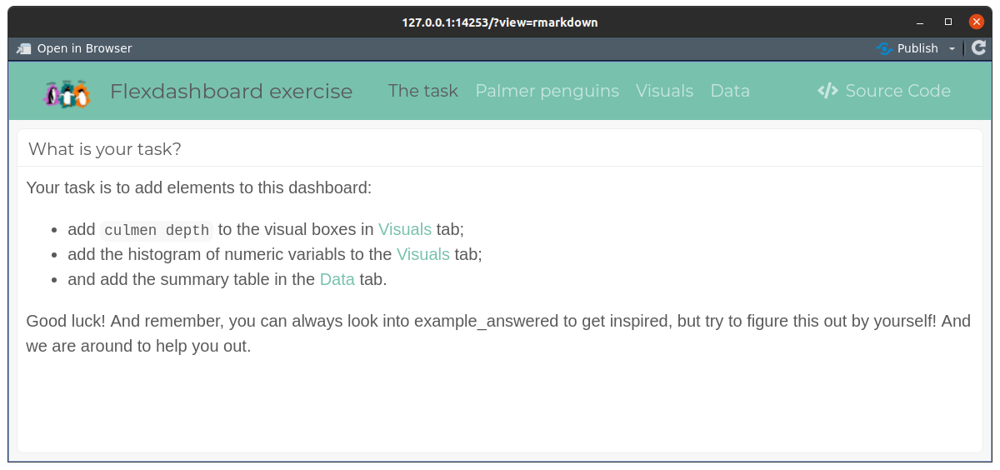
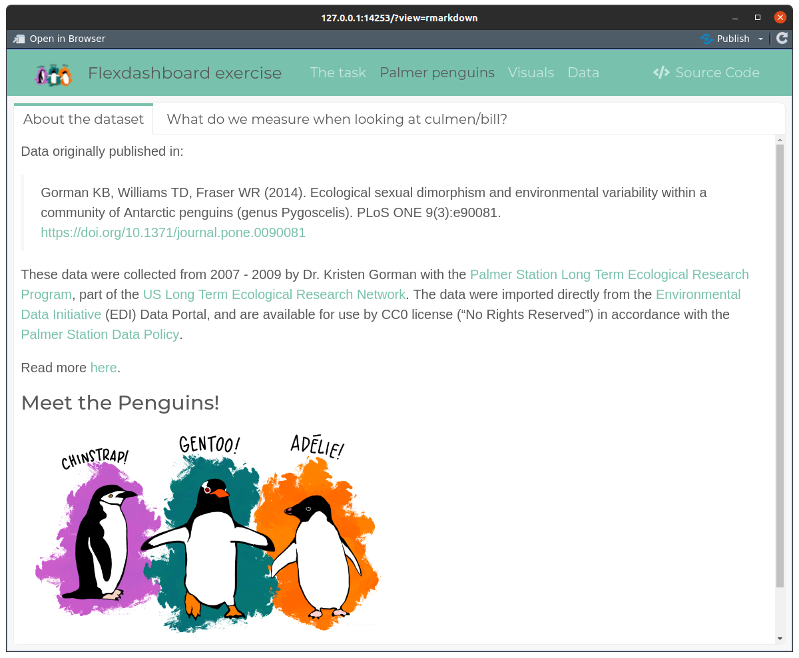
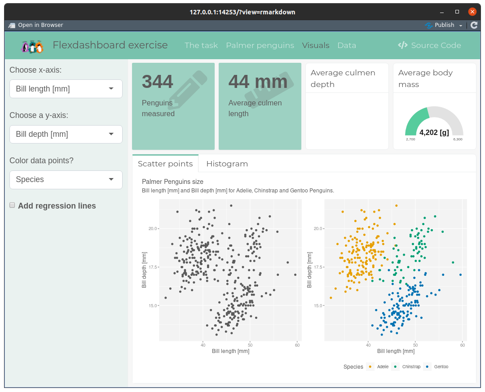
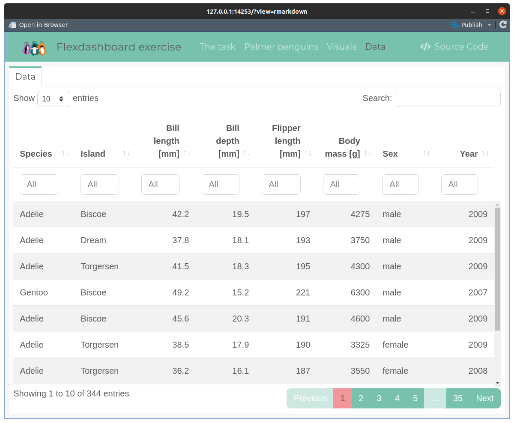

README
================

This exercise is described in the flexdashboard itself. Go ahead and
open `exercise.Rmd` file and press `Run document` at the top of the
document. You should see a pop-up window with the flex dashboard open
like below.

Go ahead and explore the dashboard. Check out the description of the
penguins dataset.

Check out the Visuals tab.

And the Data tab.

Now, come back to exercise instructions and proceed with editing the
exercise file. When in doubt ask or look up an example answer in
`example_answered.Rmd` file. Good luck!
