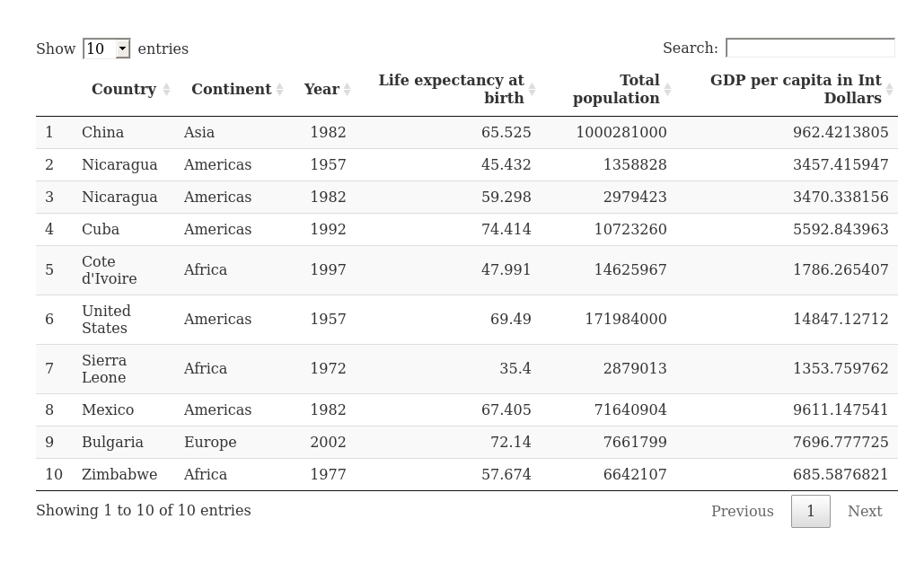
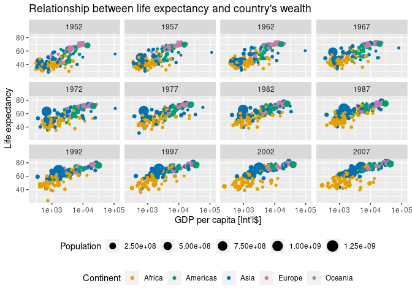
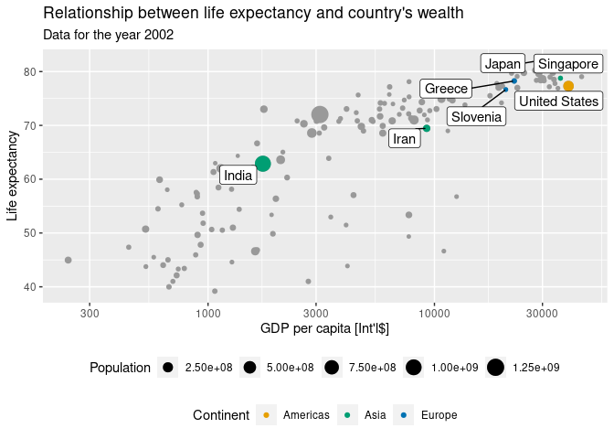
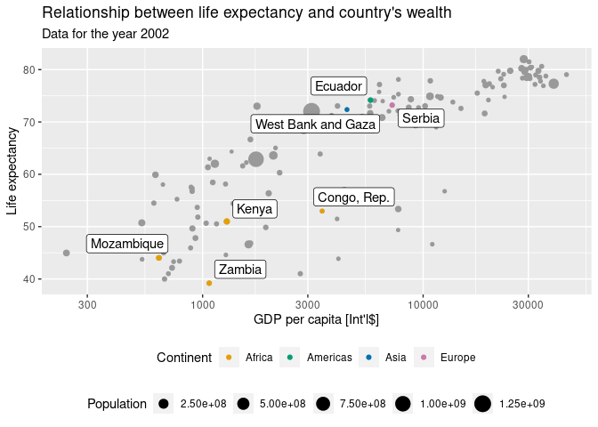
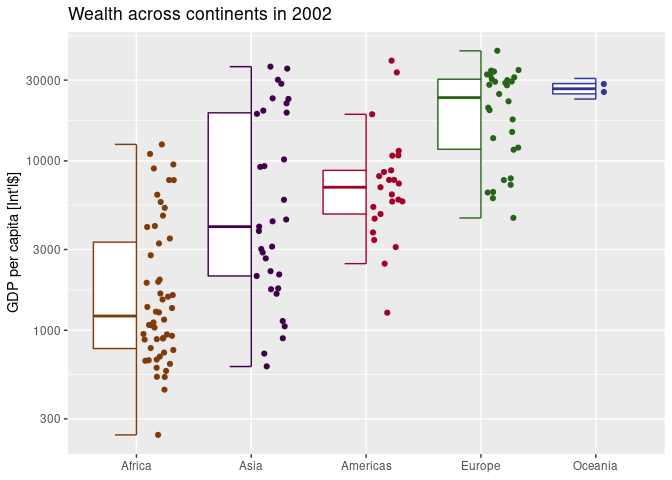

Presenting gapminder dataset
================

# Task outline

Your task is to prepare a Shiny App, or a dashboard to present and allow
exploration of the [`Gapminder`
dataset](https://www.gapminder.org/data/documentation/). In here I am
using an excerpt from the data, imported from [`gapminder` r
package](https://github.com/jennybc/gapminder) created by Jenny Bryan.

# About the gapminder dataset

Gapminder data is known from, among others, this amazing TED Talk: [The
best stats you’ve ever seen \| Hans
Rosling](https://www.youtube.com/watch?v=hVimVzgtD6w). In the talk Hans
Rosling presented the power of data visualisation to explore the world.
If you are interested in data visualisation and haven’t heard his talks,
do look them up.

`gapminder` dataset from R package with the same name contains 1704
observations with 6 variables:

-   country
-   continent
-   year (every 5 years from 1952 to 2007)
-   pop (total population)
-   gdpPercap (GDP per capita), and
-   lifeExp (life expectancy)

There are 12 observations per each country, with 142 countries. More
information on the dataset can be found in the [Exploring the
data](#exploring-the-data) section and in the documentation of the
[`gapminder` package](https://github.com/jennybc/gapminder).

If you are curious and want to explore more, be sure to check out full
dataset and other datasets gathered by the [Gapminder
team](https://www.gapminder.org/data/documentation/). However, the goal
of this exercise is to practice learning `Shiny` hence why, at least at
the beginning, sticking with the excerpt will be best.

# Exploring the data

``` r
library(tidyverse)
library(gapminder)
library(gtsummary)
thematic::thematic_rmd()
theme_update(legend.position = "bottom", legend.box = "vertical")
```

``` r
gapminder %>%
  rename(Country = country, Continent = continent, Year = year,
         `Life expectancy at birth` = lifeExp, 
         `Total population` = pop,
         `GDP per capita in Int Dollars` = gdpPercap) %>%
  slice_sample(n = 10) %>%
  DT::datatable()
```

<!-- -->

``` r
gapminder %>%
  select(-country) %>%
  tbl_summary(label = list(continent ~ "Continent", year ~ "Year",
                           lifeExp ~ "Life Expectancy", pop ~ "Population",
                           gdpPercap ~ "GDP per Capita"),
              type = all_continuous() ~ "continuous2",
              statistic = all_continuous() ~ c(
                "{median} ({p25}, {p75})",
                "{min}, {max}")) %>%
  bold_labels() %>%
  modify_header(label ~ "**Variable**")
```

<div id="oezjgwkufy" style="overflow-x:auto;overflow-y:auto;width:auto;height:auto;">
<style>html {
  font-family: -apple-system, BlinkMacSystemFont, 'Segoe UI', Roboto, Oxygen, Ubuntu, Cantarell, 'Helvetica Neue', 'Fira Sans', 'Droid Sans', Arial, sans-serif;
}

#oezjgwkufy .gt_table {
  display: table;
  border-collapse: collapse;
  margin-left: auto;
  margin-right: auto;
  color: #333333;
  font-size: 16px;
  font-weight: normal;
  font-style: normal;
  background-color: #FFFFFF;
  width: auto;
  border-top-style: solid;
  border-top-width: 2px;
  border-top-color: #A8A8A8;
  border-right-style: none;
  border-right-width: 2px;
  border-right-color: #D3D3D3;
  border-bottom-style: solid;
  border-bottom-width: 2px;
  border-bottom-color: #A8A8A8;
  border-left-style: none;
  border-left-width: 2px;
  border-left-color: #D3D3D3;
}

#oezjgwkufy .gt_heading {
  background-color: #FFFFFF;
  text-align: center;
  border-bottom-color: #FFFFFF;
  border-left-style: none;
  border-left-width: 1px;
  border-left-color: #D3D3D3;
  border-right-style: none;
  border-right-width: 1px;
  border-right-color: #D3D3D3;
}

#oezjgwkufy .gt_title {
  color: #333333;
  font-size: 125%;
  font-weight: initial;
  padding-top: 4px;
  padding-bottom: 4px;
  padding-left: 5px;
  padding-right: 5px;
  border-bottom-color: #FFFFFF;
  border-bottom-width: 0;
}

#oezjgwkufy .gt_subtitle {
  color: #333333;
  font-size: 85%;
  font-weight: initial;
  padding-top: 0;
  padding-bottom: 6px;
  padding-left: 5px;
  padding-right: 5px;
  border-top-color: #FFFFFF;
  border-top-width: 0;
}

#oezjgwkufy .gt_bottom_border {
  border-bottom-style: solid;
  border-bottom-width: 2px;
  border-bottom-color: #D3D3D3;
}

#oezjgwkufy .gt_col_headings {
  border-top-style: solid;
  border-top-width: 2px;
  border-top-color: #D3D3D3;
  border-bottom-style: solid;
  border-bottom-width: 2px;
  border-bottom-color: #D3D3D3;
  border-left-style: none;
  border-left-width: 1px;
  border-left-color: #D3D3D3;
  border-right-style: none;
  border-right-width: 1px;
  border-right-color: #D3D3D3;
}

#oezjgwkufy .gt_col_heading {
  color: #333333;
  background-color: #FFFFFF;
  font-size: 100%;
  font-weight: normal;
  text-transform: inherit;
  border-left-style: none;
  border-left-width: 1px;
  border-left-color: #D3D3D3;
  border-right-style: none;
  border-right-width: 1px;
  border-right-color: #D3D3D3;
  vertical-align: bottom;
  padding-top: 5px;
  padding-bottom: 6px;
  padding-left: 5px;
  padding-right: 5px;
  overflow-x: hidden;
}

#oezjgwkufy .gt_column_spanner_outer {
  color: #333333;
  background-color: #FFFFFF;
  font-size: 100%;
  font-weight: normal;
  text-transform: inherit;
  padding-top: 0;
  padding-bottom: 0;
  padding-left: 4px;
  padding-right: 4px;
}

#oezjgwkufy .gt_column_spanner_outer:first-child {
  padding-left: 0;
}

#oezjgwkufy .gt_column_spanner_outer:last-child {
  padding-right: 0;
}

#oezjgwkufy .gt_column_spanner {
  border-bottom-style: solid;
  border-bottom-width: 2px;
  border-bottom-color: #D3D3D3;
  vertical-align: bottom;
  padding-top: 5px;
  padding-bottom: 5px;
  overflow-x: hidden;
  display: inline-block;
  width: 100%;
}

#oezjgwkufy .gt_group_heading {
  padding-top: 8px;
  padding-bottom: 8px;
  padding-left: 5px;
  padding-right: 5px;
  color: #333333;
  background-color: #FFFFFF;
  font-size: 100%;
  font-weight: initial;
  text-transform: inherit;
  border-top-style: solid;
  border-top-width: 2px;
  border-top-color: #D3D3D3;
  border-bottom-style: solid;
  border-bottom-width: 2px;
  border-bottom-color: #D3D3D3;
  border-left-style: none;
  border-left-width: 1px;
  border-left-color: #D3D3D3;
  border-right-style: none;
  border-right-width: 1px;
  border-right-color: #D3D3D3;
  vertical-align: middle;
}

#oezjgwkufy .gt_empty_group_heading {
  padding: 0.5px;
  color: #333333;
  background-color: #FFFFFF;
  font-size: 100%;
  font-weight: initial;
  border-top-style: solid;
  border-top-width: 2px;
  border-top-color: #D3D3D3;
  border-bottom-style: solid;
  border-bottom-width: 2px;
  border-bottom-color: #D3D3D3;
  vertical-align: middle;
}

#oezjgwkufy .gt_from_md > :first-child {
  margin-top: 0;
}

#oezjgwkufy .gt_from_md > :last-child {
  margin-bottom: 0;
}

#oezjgwkufy .gt_row {
  padding-top: 8px;
  padding-bottom: 8px;
  padding-left: 5px;
  padding-right: 5px;
  margin: 10px;
  border-top-style: solid;
  border-top-width: 1px;
  border-top-color: #D3D3D3;
  border-left-style: none;
  border-left-width: 1px;
  border-left-color: #D3D3D3;
  border-right-style: none;
  border-right-width: 1px;
  border-right-color: #D3D3D3;
  vertical-align: middle;
  overflow-x: hidden;
}

#oezjgwkufy .gt_stub {
  color: #333333;
  background-color: #FFFFFF;
  font-size: 100%;
  font-weight: initial;
  text-transform: inherit;
  border-right-style: solid;
  border-right-width: 2px;
  border-right-color: #D3D3D3;
  padding-left: 5px;
  padding-right: 5px;
}

#oezjgwkufy .gt_stub_row_group {
  color: #333333;
  background-color: #FFFFFF;
  font-size: 100%;
  font-weight: initial;
  text-transform: inherit;
  border-right-style: solid;
  border-right-width: 2px;
  border-right-color: #D3D3D3;
  padding-left: 5px;
  padding-right: 5px;
  vertical-align: top;
}

#oezjgwkufy .gt_row_group_first td {
  border-top-width: 2px;
}

#oezjgwkufy .gt_summary_row {
  color: #333333;
  background-color: #FFFFFF;
  text-transform: inherit;
  padding-top: 8px;
  padding-bottom: 8px;
  padding-left: 5px;
  padding-right: 5px;
}

#oezjgwkufy .gt_first_summary_row {
  border-top-style: solid;
  border-top-color: #D3D3D3;
}

#oezjgwkufy .gt_first_summary_row.thick {
  border-top-width: 2px;
}

#oezjgwkufy .gt_last_summary_row {
  padding-top: 8px;
  padding-bottom: 8px;
  padding-left: 5px;
  padding-right: 5px;
  border-bottom-style: solid;
  border-bottom-width: 2px;
  border-bottom-color: #D3D3D3;
}

#oezjgwkufy .gt_grand_summary_row {
  color: #333333;
  background-color: #FFFFFF;
  text-transform: inherit;
  padding-top: 8px;
  padding-bottom: 8px;
  padding-left: 5px;
  padding-right: 5px;
}

#oezjgwkufy .gt_first_grand_summary_row {
  padding-top: 8px;
  padding-bottom: 8px;
  padding-left: 5px;
  padding-right: 5px;
  border-top-style: double;
  border-top-width: 6px;
  border-top-color: #D3D3D3;
}

#oezjgwkufy .gt_striped {
  background-color: rgba(128, 128, 128, 0.05);
}

#oezjgwkufy .gt_table_body {
  border-top-style: solid;
  border-top-width: 2px;
  border-top-color: #D3D3D3;
  border-bottom-style: solid;
  border-bottom-width: 2px;
  border-bottom-color: #D3D3D3;
}

#oezjgwkufy .gt_footnotes {
  color: #333333;
  background-color: #FFFFFF;
  border-bottom-style: none;
  border-bottom-width: 2px;
  border-bottom-color: #D3D3D3;
  border-left-style: none;
  border-left-width: 2px;
  border-left-color: #D3D3D3;
  border-right-style: none;
  border-right-width: 2px;
  border-right-color: #D3D3D3;
}

#oezjgwkufy .gt_footnote {
  margin: 0px;
  font-size: 90%;
  padding-left: 4px;
  padding-right: 4px;
  padding-left: 5px;
  padding-right: 5px;
}

#oezjgwkufy .gt_sourcenotes {
  color: #333333;
  background-color: #FFFFFF;
  border-bottom-style: none;
  border-bottom-width: 2px;
  border-bottom-color: #D3D3D3;
  border-left-style: none;
  border-left-width: 2px;
  border-left-color: #D3D3D3;
  border-right-style: none;
  border-right-width: 2px;
  border-right-color: #D3D3D3;
}

#oezjgwkufy .gt_sourcenote {
  font-size: 90%;
  padding-top: 4px;
  padding-bottom: 4px;
  padding-left: 5px;
  padding-right: 5px;
}

#oezjgwkufy .gt_left {
  text-align: left;
}

#oezjgwkufy .gt_center {
  text-align: center;
}

#oezjgwkufy .gt_right {
  text-align: right;
  font-variant-numeric: tabular-nums;
}

#oezjgwkufy .gt_font_normal {
  font-weight: normal;
}

#oezjgwkufy .gt_font_bold {
  font-weight: bold;
}

#oezjgwkufy .gt_font_italic {
  font-style: italic;
}

#oezjgwkufy .gt_super {
  font-size: 65%;
}

#oezjgwkufy .gt_two_val_uncert {
  display: inline-block;
  line-height: 1em;
  text-align: right;
  font-size: 60%;
  vertical-align: -0.25em;
  margin-left: 0.1em;
}

#oezjgwkufy .gt_footnote_marks {
  font-style: italic;
  font-weight: normal;
  font-size: 75%;
  vertical-align: 0.4em;
}

#oezjgwkufy .gt_asterisk {
  font-size: 100%;
  vertical-align: 0;
}

#oezjgwkufy .gt_slash_mark {
  font-size: 0.7em;
  line-height: 0.7em;
  vertical-align: 0.15em;
}

#oezjgwkufy .gt_fraction_numerator {
  font-size: 0.6em;
  line-height: 0.6em;
  vertical-align: 0.45em;
}

#oezjgwkufy .gt_fraction_denominator {
  font-size: 0.6em;
  line-height: 0.6em;
  vertical-align: -0.05em;
}
</style>
<table class="gt_table">
  
  <thead class="gt_col_headings">
    <tr>
      <th class="gt_col_heading gt_columns_bottom_border gt_left" rowspan="1" colspan="1"><strong>Variable</strong></th>
      <th class="gt_col_heading gt_columns_bottom_border gt_center" rowspan="1" colspan="1"><strong>N = 1,704</strong><sup class="gt_footnote_marks">1</sup></th>
    </tr>
  </thead>
  <tbody class="gt_table_body">
    <tr><td class="gt_row gt_left" style="font-weight: bold;">Continent</td>
<td class="gt_row gt_center"></td></tr>
    <tr><td class="gt_row gt_left" style="text-align: left; text-indent: 10px;">Africa</td>
<td class="gt_row gt_center">624 (37%)</td></tr>
    <tr><td class="gt_row gt_left" style="text-align: left; text-indent: 10px;">Americas</td>
<td class="gt_row gt_center">300 (18%)</td></tr>
    <tr><td class="gt_row gt_left" style="text-align: left; text-indent: 10px;">Asia</td>
<td class="gt_row gt_center">396 (23%)</td></tr>
    <tr><td class="gt_row gt_left" style="text-align: left; text-indent: 10px;">Europe</td>
<td class="gt_row gt_center">360 (21%)</td></tr>
    <tr><td class="gt_row gt_left" style="text-align: left; text-indent: 10px;">Oceania</td>
<td class="gt_row gt_center">24 (1.4%)</td></tr>
    <tr><td class="gt_row gt_left" style="font-weight: bold;">Year</td>
<td class="gt_row gt_center"></td></tr>
    <tr><td class="gt_row gt_left" style="text-align: left; text-indent: 10px;">Median (IQR)</td>
<td class="gt_row gt_center">1,980 (1,966, 1,993)</td></tr>
    <tr><td class="gt_row gt_left" style="text-align: left; text-indent: 10px;">Range</td>
<td class="gt_row gt_center">1,952, 2,007</td></tr>
    <tr><td class="gt_row gt_left" style="font-weight: bold;">Life Expectancy</td>
<td class="gt_row gt_center"></td></tr>
    <tr><td class="gt_row gt_left" style="text-align: left; text-indent: 10px;">Median (IQR)</td>
<td class="gt_row gt_center">61 (48, 71)</td></tr>
    <tr><td class="gt_row gt_left" style="text-align: left; text-indent: 10px;">Range</td>
<td class="gt_row gt_center">24, 83</td></tr>
    <tr><td class="gt_row gt_left" style="font-weight: bold;">Population</td>
<td class="gt_row gt_center"></td></tr>
    <tr><td class="gt_row gt_left" style="text-align: left; text-indent: 10px;">Median (IQR)</td>
<td class="gt_row gt_center">7,023,596 (2,793,664, 19,585,222)</td></tr>
    <tr><td class="gt_row gt_left" style="text-align: left; text-indent: 10px;">Range</td>
<td class="gt_row gt_center">60,011, 1,318,683,096</td></tr>
    <tr><td class="gt_row gt_left" style="font-weight: bold;">GDP per Capita</td>
<td class="gt_row gt_center"></td></tr>
    <tr><td class="gt_row gt_left" style="text-align: left; text-indent: 10px;">Median (IQR)</td>
<td class="gt_row gt_center">3,532 (1,202, 9,325)</td></tr>
    <tr><td class="gt_row gt_left" style="text-align: left; text-indent: 10px;">Range</td>
<td class="gt_row gt_center">241, 113,523</td></tr>
  </tbody>
  
  <tfoot class="gt_footnotes">
    <tr>
      <td class="gt_footnote" colspan="2"><sup class="gt_footnote_marks">1</sup> n (%)</td>
    </tr>
  </tfoot>
</table>
</div>

# Some tips, ideas and code

First of all, you can show the relationship between life expectancy and
country’s wealth across the years.

``` r
gapminder %>%
  ggplot(aes(gdpPercap, lifeExp, color = continent, size = pop)) +
  geom_point() +
  facet_wrap(~year) +
  scale_x_log10() + 
  labs(title = "Relationship between life expectancy and country's wealth",
       x = "GDP per capita [Int'l$]",
       y = "Life expectancy", 
       color = "Continent", size = "Population") +
  theme(legend.position = "bottom", 
        legend.box = "vertical")
```

<!-- -->

For example, you might want to create a reactive plot, where the user
will be able to choose a country to highlight and a year to show on the
plot.

``` r
selected_countries <-
  sample(unique(gapminder$country), 7)
selected_year <- "2002"

gapminder %>%
  mutate(selected = country %in% selected_countries) %>%
  filter(year == selected_year) %>%
  ggplot(aes(gdpPercap, lifeExp)) +
  geom_point(color = "grey60", aes(size = pop)) +
  geom_point(data = . %>% filter(selected), aes(size = pop,
                                                color = continent)) +
  ggrepel::geom_label_repel(data = . %>% filter(selected), 
                            aes(label = country)) +
  scale_x_log10() + 
  labs(title = "Relationship between life expectancy and country's wealth",
       subtitle = glue::glue("Data for the year {selected_year}"),
       x = "GDP per capita [Int'l$]",
       y = "Life expectancy", 
       color = "Continent", size = "Population") 
```

<!-- -->

Another idea for visualising the data is to look at the change of life
expectancy.

``` r
gapminder %>%
  ggplot(aes(year, lifeExp, group = country, color = continent)) +
  geom_line() +
  facet_wrap(~continent) +
  scale_color_manual(values = continent_colors) + 
  labs(title = "Change of life expectancy across the years",
       x = "Year",
       y = "Life expectancy", 
       color = "Continent") +
  scale_x_continuous(breaks = unique(gapminder$year)[c(TRUE, FALSE, FALSE)])
```

<!-- --> Or to look up
wealth per continent.

``` r
gapminder %>%
  filter(year == selected_year) %>%
  group_by(continent) %>%
  mutate(continent_median = median(gdpPercap)) %>%
  ggplot(aes(x = reorder(continent, continent_median), 
             y = gdpPercap, color = continent)) +
  gghalves::geom_half_point() +
  gghalves::geom_half_boxplot(outlier.shape = NA) +
  # if gghalves not available
  # geom_jitter() +
  # geom_boxplot(width = .1, outlier.shape = NA, 
  #              alpha = 0.4, color = "grey60") + 
  scale_color_manual(values = continent_colors) + 
  labs(title = glue::glue("Wealth across continents in {selected_year}"),
       y = "GDP per capita [Int'l$]", 
       color = "Continent") +
  scale_y_log10() +
  theme(axis.title.x = element_blank(), 
        legend.position = "none")
```

<!-- -->

# Your turn!

Those are just some ideas, now it’s time for you to create your own
Shiny App and explore the dataset even more! Good luck. :)
