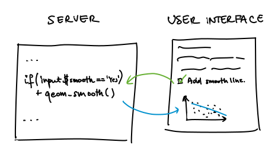

```{r xaringan-themer, include=FALSE, warning=FALSE}
library(xaringanthemer)
style_mono_light(base_color = "#23395b")
```

```{r xaringanExtra, include=FALSE, echo=FALSE}
xaringanExtra::use_fit_screen()
xaringanExtra::use_clipboard()

xaringanExtra::use_progress_bar(color = "#23395b", 
                                location = "top", height = "10px")
xaringanExtra::use_extra_styles(hover_code_line = TRUE, 
                                mute_unhighlighted_code = FALSE)
```

```{r setup, include=FALSE}
options(htmltools.dir.version = FALSE)
```

# About me

Hello! 

I'm a 4th year (ouch!) PhD student in Genomic Medicine at the Wellcome Centre for Human Genetics.

I use R a lot - for data viz, data analysis, to create this slideshow, for my personal website and to play with Generative aRt. It is safe to say I like R a bit.

I also like questions, so please go ahead and ask me any throughout this workshop. If at any point you feel lost let me know. I also brought help with me - so there's twice as many of us to help you out. :)


---

# Before we start

* **This workshop is very much hands on**. Please make sure you cloned the repository and it is up to date. We will go through a presentation and run/edit examples and create our own applications all throughout. 

--

* **This is an Introduction to Shiny**. The goal of this workshop is to give you and idea of what `shiny` is, and help you break the ice and create your first Hello world! applications and dashboards.

--

* **Check out the other materials**. I list a lot of other resources - R community is brilliant in providing support in learning new skills and there is plenty of 

---

# Asking for help

For this workshop we will use green, orange and red sticky notes. The way this works is at various points, when you will get to do your exercises I will ask you to put one of the stickers on your laptop.

#### <span style="background-color: #84A59D">green</span> 
I'm doing well! Keeping up, I am working on the example, know what to do.  

#### <span style="background-color: #F6BD60">orange</span>
I am a little bit lost, not sure exactly do, `R` speaks warnings to me.  

#### <span style="background-color: #B20D30">red</span>

I need help, I am lost, not sure what am I supposed to do or `R` is throwing errors at me.

---

class: inverse, center, middle

# What is Shiny?

---

# What is Shiny?

> Shiny is an R package that makes it easy to build interactive web apps straight from R.

* allows to present the analysis interactively, taking user input into account
* 

---

### Palmer penguins example - plot

```{r, echo=FALSE, warning=FALSE, message=FALSE, fig.width=9, dev.args=list(bg = "transparent"), fig.height=5, dpi=96}
library(tidyverse)
library(patchwork)
library(glue)
library(palmerpenguins)
library(ggthemes)

xaxis <- "bill_length_mm"
x_name <- "Bill length [mm]"
yaxis <- "bill_depth_mm"
y_name <- "Bill depth [mm]"
colorby <- "species"

plt_all <-
  penguins %>%
  ggplot(aes_string(x = xaxis, y = yaxis)) +
  geom_point() +
  labs(x = x_name,
       y = y_name) 

plt <-
  penguins %>%
  ggplot(aes_string(x = xaxis, y = yaxis, color = colorby)) +
  geom_point() +
  labs(x = x_name,
       y = y_name,
       color = "Species") +
  scale_color_economist() 

patch <- 
  plt_all + 
  plt +
  plot_annotation(title = "Palmer Penguins size",
                  subtitle = glue(
                    "{x_name} and {y_name} for {glue_collapse(sort(unique(penguins$species)), sep = ', ', last = ' and ')} Penguins.")) 

patch & theme_minimal() & theme(legend.position = "bottom", 
                                panel.grid.major = element_line(color = "white"))
```


---

### Palmer penguins example - app

<iframe id="scaled-frame" src="https://kzkedzierska.shinyapps.io/penguin_plot_/" width=900 height=480 frameBorder="0"></iframe>

---
class: inverse, center, middle


# Structure
---

---
### Reactive elements 

We can add reactive elements. For example, we can add a plot that will add 

.center[

]

---
### Reactive elements 

.pull-left.w60[
.center[
Inside the server block we will have a code like that:  
]
  
```{r, eval=FALSE}
server <- function(input, output) {
  ...
  output$plt <- 
    renderPlot({
      penguins %>%
        ggplot(aes(x = bill_length_mm, 
                   y = bill_depth_mm)) +
        geom_point() + 
        { if(input$smooth == "yes") { 
          geom_smooth(se = FALSE, 
                      method = "lm", 
                      formula = "y ~ x")
          }}
    })
  ...
}
```

] 

.pull-right.w35[
.center[
And in the UI this is what user will see depending chosen option: 

```{r, echo=FALSE, message=FALSE, error=FALSE, warning=FALSE}
save_to_dir <- "misc/gif_smooth/"

library(ggthemes)
if (length(list.files(save_to_dir, pattern = ".png")) < 2) {
  plt_penguin_gif1 <-
    penguins %>%
    ggplot(aes(x = bill_length_mm, y = bill_depth_mm)) +
    geom_point() +
    labs(x = "Bill length [mm]",
         y = "Bill depth [mm]",
         title = "Smooth: no") +
    theme_economist()
  
  ggsave(plot = plt_penguin_gif1, 
         filename = "plt_penguin_gif1.png", path = save_to_dir, 
         width = 4, height = 4, dpi = 96,
         bg = "transparent")
  
  plt_penguin_gif2 <-
    plt_penguin_gif1 +
    geom_smooth(se = FALSE, method = "lm", formula = "y ~ x") +
    labs(title = "Smooth: yes")
  
  ggsave(plot = plt_penguin_gif2, 
         filename = "plt_penguin_gif2.png", path = save_to_dir,  
         width = 4, height = 4, dpi = 96,
         bg = "transparent")
}

library(magick)
imgs <- list.files(save_to_dir, full.names = TRUE)
img_list <- lapply(imgs, image_read)

## join the images together
img_joined <- image_join(img_list)

## animate at 2 frames per second
img_animated <- image_animate(img_joined, fps = 1)

## view animated image
img_animated
```

]]


---

### Thanks for following!

It's now time for questions and chat :)

.center[**Upcoming [NGSchool](https://ngschool.eu/) Society Events**]

<table>
<tr>
<td> </td>
<td></td>
</tr>
<tr>
<td>23 - 24.09.2022 </td>
<td>15 - 23.09.2022</td>
</tr>
<tr>
<td>Warsaw, Poland</td>
<td>Jablonna near Warsaw, Poland</td>
</tr>
<tr>
<td>Abstracts deadline: <b>23.05</b> <br>
Registration deadline: 20.08 <br>
Early Bird: <b>11.07</b> </td>
<td>Registration deadline: <b>30.05</b> <br> Fee: 200 EUR (includes accom. and board!)</td>
</tr>
<tr>
<td><a href=https://ngschool.eu/ngsymposium2022/>ngschool.eu/ngsymposium2022/</a></td>
<td><a href=https://ngschool.eu/ngschool2022/>ngschool.eu/ngschool2022/</a></td>
<tr>
</table>


 


.footnote[Slides created via the R package [**xaringan**](https://github.com/yihui/xaringan).]