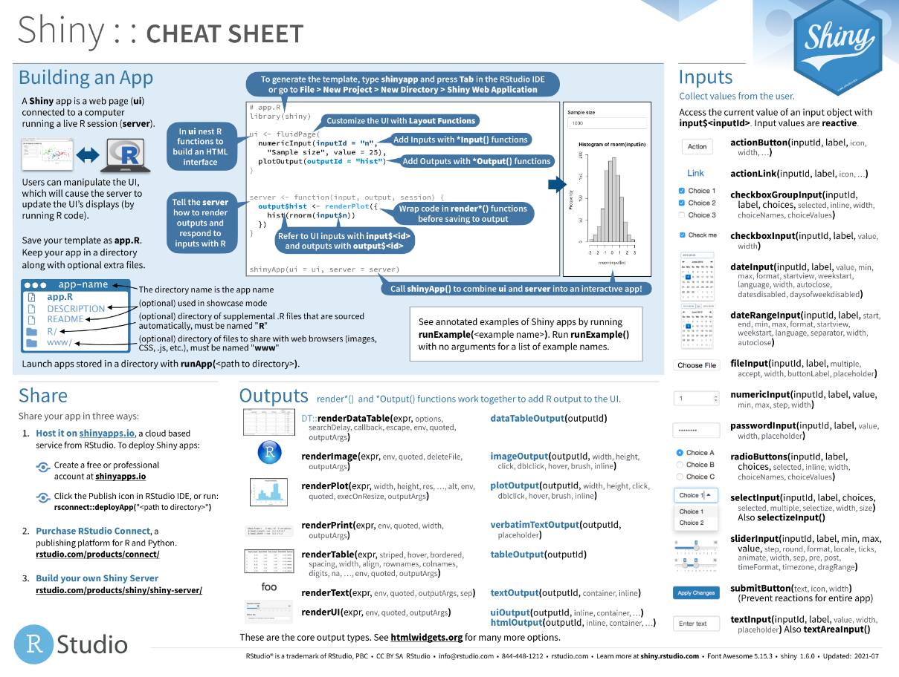
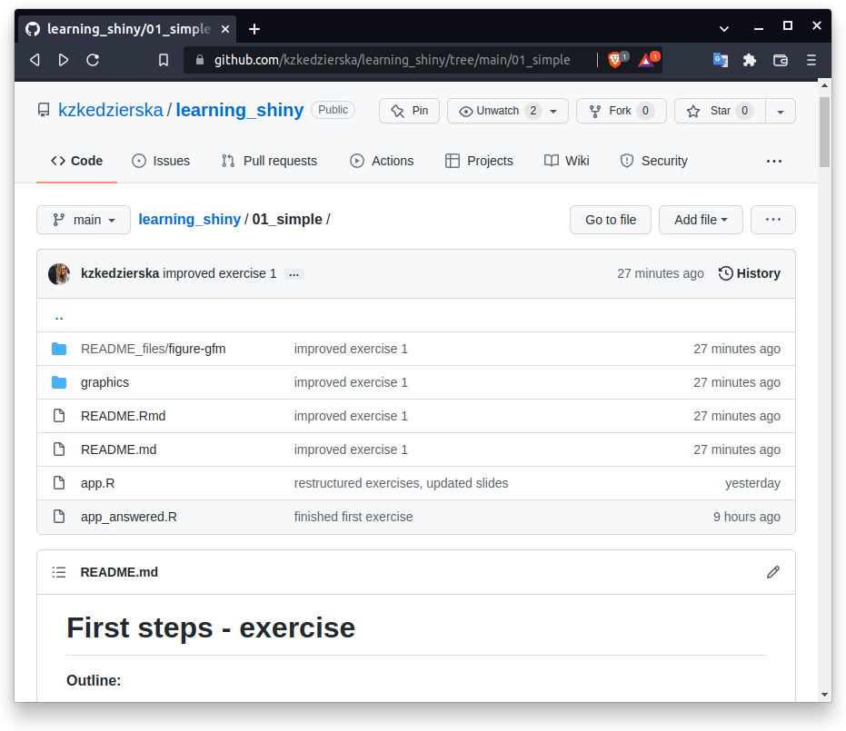
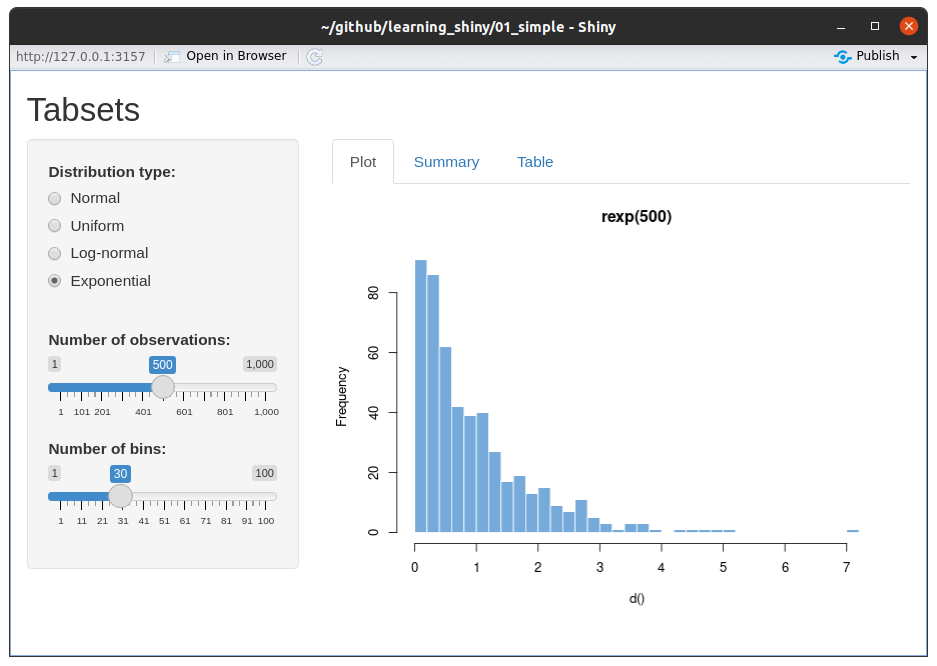
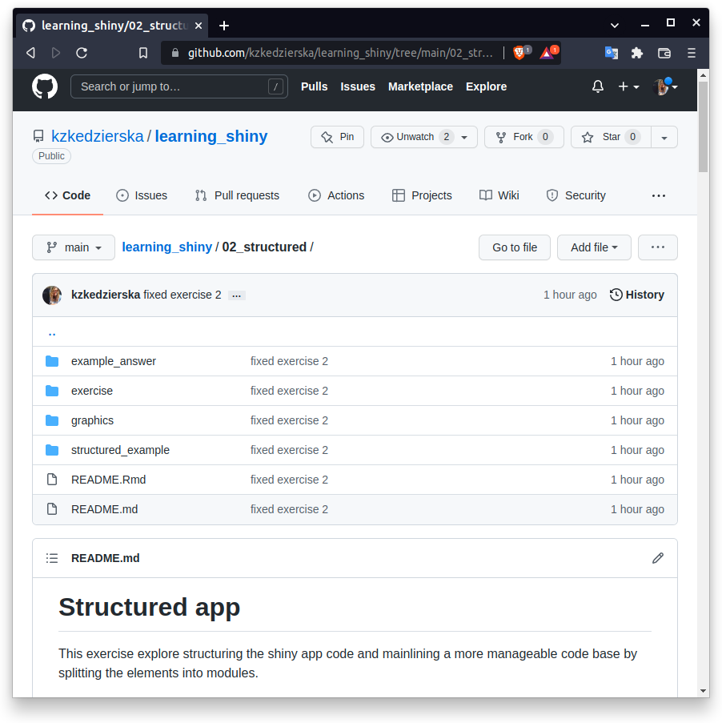
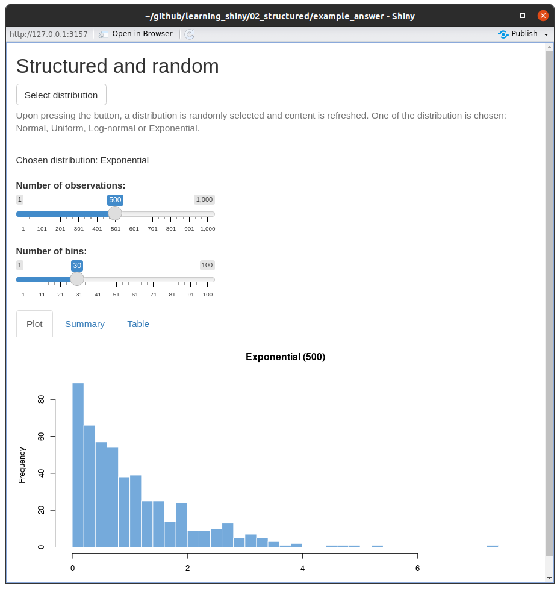
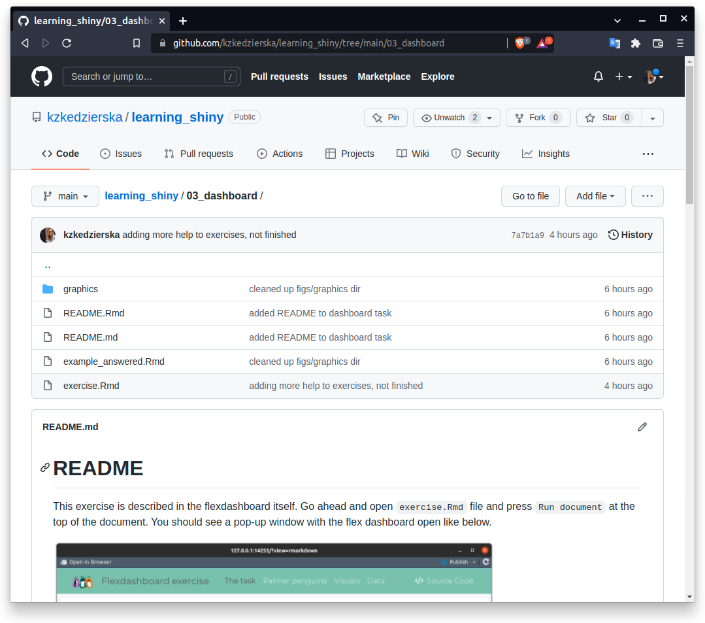
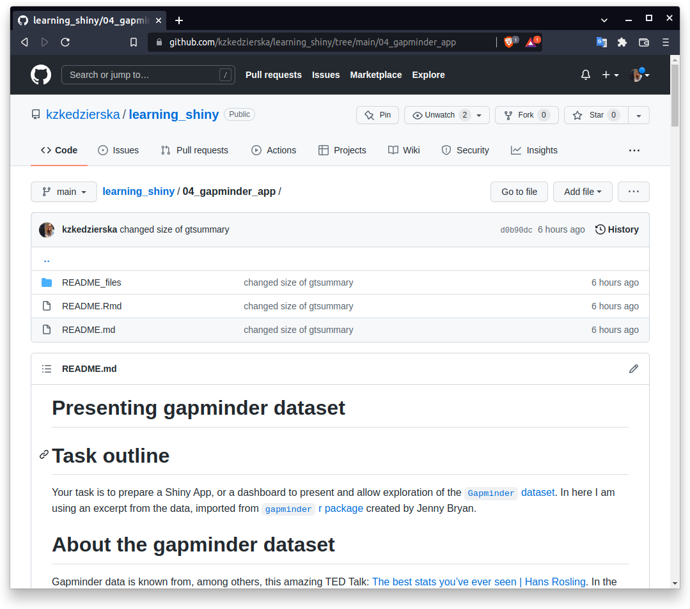

```{r xaringan-themer, include=FALSE, warning=FALSE}
library(xaringanthemer)
style_mono_light(base_color = "#23395b")
```

```{r xaringanExtra, include=FALSE, echo=FALSE}
# xaringanExtra::use_fit_screen()
xaringanExtra::use_clipboard()
xaringanExtra::use_extra_styles(hover_code_line = TRUE, 
                                mute_unhighlighted_code = TRUE)
xaringanExtra::use_progress_bar(color = "black", 
                                location = "top", height = "200px")
```

```{r setup, include=FALSE}
options(htmltools.dir.version = FALSE)
```

# About me

Hello! 

I'm a 4th year (ouch!) PhD student in Genomic Medicine at the Wellcome Centre for Human Genetics.

I use R a lot - for data viz, data analysis, to create this slideshow, for my personal website and to play with Generative aRt. It is safe to say I like R a bit.

I also like questions, so please go ahead and ask me any throughout this workshop. If at any point you feel lost let me know. I also brought help with me - so there's twice as many of us to help you out. :)

.footnote[This presentation and exercises will probably be riddled with typos despite my great efforts to fix them. Apologies for that, it is my ~~course~~ curse I need to live with.]

---

# Before we start

* **This workshop is very much hands on**. Please make sure you cloned the repository and it is up to date. We will go through a presentation and run/edit examples and create our own applications all throughout. 

--

* **This is an Introduction to Shiny**. The goal of this workshop is to give you and idea of what `shiny` is, and help you break the ice and create your first Hello world! applications and dashboards.

--

* **Check out linked resources**. I list a lot of other materials - R community is brilliant in providing support in learning new skills and there is plenty of 

---

# Asking for help

For this workshop we will use green, orange and red sticky notes. The way this works is at various points, when you will get to do your exercises I will ask you to put one of the stickers on your laptop.

#### <span style="background-color: #84A59D">green</span> 
I'm doing well! Keeping up, I am working on the example, know what to do.  

#### <span style="background-color: #F6BD60">orange</span>
I am a little bit lost, not sure exactly do, `R` speaks warnings to me.  

#### <span style="background-color: #B20D30">red</span>

I need help, I am lost, not sure what am I supposed to do or `R` is throwing errors at me.

---

### Outline

* Shiny - introduction
  * What is shiny?
  * Gallery of shiny examples
  * Resources
* Anatomy of shiny apps
  * server, ui
  * reactivity
  * inputs, outputs
  * **ex. 01_simple**
  * layout
  * app organisation
  * modules
  * **ex. 02_structured**
* Beyond Shiny
  * customisation, extensions
  * Dashboards 
  * **ex. 03_dashboard**  
* **ex. 04_gapminder_app**

---
class: inverse, center, middle

# Shiny - introduction  

---

## What is Shiny?

> Shiny is an R package that makes it easy to build interactive web apps straight from R.

In other words it allows us to build web apps without having to learn html or javascript*. 

Shiny allows to create interactive reports, online analyses and much more.

One can create a standalone apps or use shiny in R Markdown documents or build dashboards. 

.footnote[**not entirely true as the more you work with shiny the more you will want to tweak it and use some html and/or javascript. But you don't need at the start for sure!*]


---

### Palmer penguins example - plot

```{r penguin_plot, echo=FALSE, warning=FALSE, message=FALSE, fig.width=9, dev.args=list(bg = "transparent"), fig.height=5, dpi=300}
library(tidyverse)
library(patchwork)
library(glue)
library(palmerpenguins)

xaxis <- "bill_length_mm"
x_name <- "Bill length [mm]"
yaxis <- "bill_depth_mm"
y_name <- "Bill depth [mm]"
colorby <- "species"

plt_all <-
  penguins %>%
  ggplot(aes_string(x = xaxis, y = yaxis)) +
  geom_point() +
  labs(x = x_name,
       y = y_name) 

plt <-
  penguins %>%
  ggplot(aes_string(x = xaxis, y = yaxis, color = colorby)) +
  geom_point() +
  labs(x = x_name,
       y = y_name,
       color = "Species") +
  ggthemes::scale_color_economist() 

patch <- 
  plt_all + 
  plt +
  plot_annotation(title = "Palmer Penguins size",
                  subtitle = glue(
                    "{x_name} and {y_name} for {glue_collapse(sort(unique(penguins$species)), sep = ', ', last = ' and ')} Penguins.")) 

patch & theme_minimal() & theme(legend.position = "bottom", 
                                panel.grid.major = element_line(color = "white"))
```


---

### Palmer penguins example - app

<iframe id="scaled-frame" src="https://kzkedzierska.shinyapps.io/penguin_plot/" width=900 height=480 frameBorder="0"></iframe>

---
## Shiny Apps gallery

<iframe src="https://shiny.rstudio.com/gallery/#demos" width=900 height=425 frameBorder="0"></iframe>

.footnote[[shiny.rstudio.com/gallery/](https://shiny.rstudio.com/gallery/)]

---
## Resources

* [Mastering Shiny](https://mastering-shiny.org/) by Hadley Wickham
* [Shiny tutorial](https://shiny.rstudio.com/tutorial/) on RStudio website
* [Shiny Cheatsheet](https://github.com/rstudio/cheatsheets/blob/main/shiny.pdf)

```{r, echo=FALSE}
knitr::include_app("https://shiny.rstudio.com/tutorial/written-tutorial/lesson1/",
                   height = 350)
```

---

```{r echo=FALSE}

```

---
class: inverse, center, middle

# Anatomy of shiny  

---

## Anatomy of Shiny App 

Shiny requires:

* user interface, the HTML webpage humans interact with
* server, the powerhouse of an app

.pull-left.w55[

```{r, eval=FALSE}
library(shiny) #<<

ui <- fluidPage(
  "Hello, world!"
)

server <- 
  function(input, output, session) {
}
shinyApp(ui, server) 
```
]

.pull-right.w40[
.center[

]
]

---
## Anatomy of Shiny App  

Shiny requires:

* **user interface**, the HTML webpage humans interact with
* server, the powerhouse of an app

.pull-left.w55[

```{r, eval=FALSE}
library(shiny) 

ui <- fluidPage( #<<
  "Hello, world!" #<<
) #<<

server <- 
  function(input, output, session) {
}
shinyApp(ui, server) 
```
]

.pull-right.w40[
.center[

]
]

---
## Anatomy of Shiny App 

Shiny requires:

* user interface, the HTML webpage humans interact with
* **server**, the powerhouse of an app

.pull-left.w55[

```{r, eval=FALSE}
library(shiny) 

ui <- fluidPage(
  "Hello, world!"
)

server <-  #<<
  function(input, output, session) { #<<
  } #<<
shinyApp(ui, server) 
```
]

.pull-right.w40[
.center[

]
]

---
## Anatomy of Shiny App 

Shiny requires:

* user interface, the HTML webpage humans interact with
* server, the powerhouse of an app

.pull-left.w55[

```{r, eval=FALSE}
library(shiny)

ui <- fluidPage(
  "Hello, world!"
)

server <- 
  function(input, output, session) {
}
shinyApp(ui, server) #<<
```
]

.pull-right.w40[
.center[

]
]


---
## Reactive elements 

The key functionality of Shiny are reactive elements we can add to our apps. For example, remember the plot from previous simple example? We were able to add regression line after selecting the proper option. That is because the app **reacted** to our (= user) input.

.center[

]

---
## Reactive elements 

.pull-left.w60[
.center[
Inside the server block we will have a code like that:  
]
  
```{r, eval=FALSE}
server <- function(input, output) {
  ...
  output$plt <- 
    renderPlot({
      penguins %>%
        ggplot(aes(x = bill_length_mm, 
                   y = bill_depth_mm)) +
        geom_point() + 
        { if(input$smooth == "yes") { 
          geom_smooth(se = FALSE, 
                      method = "lm", 
                      formula = "y ~ x")
          }}
    })
  ...
}
```

] 

.pull-right.w35[
.center[
And in the UI this is what user will see depending chosen option: 

```{r reatcive_gif, echo=FALSE, message=FALSE, error=FALSE, warning=FALSE}
save_to_dir <- "misc/gif_smooth/"

if (length(list.files(save_to_dir, pattern = ".png")) < 2) {
  plt_penguin_gif1 <-
    penguins %>%
    ggplot(aes(x = bill_length_mm, y = bill_depth_mm)) +
    geom_point() +
    labs(x = "Bill length [mm]",
         y = "Bill depth [mm]",
         title = "Smooth: no") +
    ggthemes::theme_economist()
  
  ggsave(plot = plt_penguin_gif1, 
         filename = "plt_penguin_gif1.png", path = save_to_dir, 
         width = 4, height = 4, dpi = 96,
         bg = "transparent")
  
  plt_penguin_gif2 <-
    plt_penguin_gif1 +
    geom_smooth(se = FALSE, method = "lm", formula = "y ~ x") +
    labs(title = "Smooth: yes")
  
  ggsave(plot = plt_penguin_gif2, 
         filename = "plt_penguin_gif2.png", path = save_to_dir,  
         width = 4, height = 4, dpi = 96,
         bg = "transparent")
}

library(magick)
imgs <- list.files(save_to_dir, full.names = TRUE)
img_list <- lapply(imgs, image_read)

## join the images together
img_joined <- image_join(img_list)

## animate at 2 frames per second
img_animated <- image_animate(img_joined, fps = 1)

## view animated image
img_animated
```

]]

---
## Reactive elements 

* `reactive()` - reactive expression, can be called by other code

```{r eval=FALSE}
d <- 
  reactive({
    dist <- switch(input$dist,
                   norm = rnorm,
                   unif = runif,
                   lnorm = rlnorm,
                   exp = rexp,
                   rnorm)
    
    dist(input$n)
  })
```

* `observeEvent()` - runs the code if the value changes
* `reactiveVal*()` - allows to create reactive values which can be set, and later updated
* `render*()` - builds an object 

---
## Reactive elements 

* `reactive()` - reactive expression, can be called by other code
* `observeEvent()` - runs the code if the value changes

```{r eval=FALSE}
observeEvent(input$button, {
  count(count() + 1)
})

```

* `reactiveVal*()` - allows to create reactive values which can be set, and later updated
* `render*()` - builds an object 

---
## Reactive elements 

* `reactive()` - reactive expression, can be called by other code
* `observeEvent()` - runs the code if the value changes
* `reactiveVal*()` - allows to create reactive values which can be set, and later updated

```{r eval=FALSE}
count <- reactiveVal(0)
observeEvent(input$button, {
  count(count() + 1)
})
```

* `render*()` - builds an object 

---
## Reactive elements 

* `reactive()` - reactive expression, can be called by other code
* `observeEvent()` - runs the code if the value changes
* `reactiveVal*()` - allows to create reactive values which can be set, and later updated
* `render*()` - builds an object 

```{r, eval=FALSE}
output$plot <- renderPlot({
  hist(d())
})
```


--

and more! Check out [User reactive expressions](https://shiny.rstudio.com/tutorial/written-tutorial/lesson6/) from RStudio tutorial.

---
## Histogram App

.pull-left.w60[
```{r eval=FALSE}
library(shiny)

ui <- fluidPage(
  title = "Histogram App",
  sliderInput(inputId = "n", 
              label = "Number of observations", 
              value = 500,
              min = 1, max = 10000),
  plotOutput(outputId = "hist")
)

server <- 
  function(input, output, session) {
    output$hist <- renderPlot({
      nobs <- input$n
      hist(rnorm(nobs))
    })
  }
shinyApp(ui, server)
```
]

.pull-right.w35[
```{r echo=FALSE}
knitr::include_graphics("misc/histogram_app.png")
```
]

---
## Inputs

`input`, a **named list**, is passed to the server and it can be accessed inside server call.

```{r eval=FALSE}
library(shiny)

ui <- fluidPage(
  title = "Histogram App",
  sliderInput(inputId = "n", #<<
              label = "Number of observations", #<<
              value = 500, #<<
              min = 1, max = 10000), #<<
  plotOutput(outputId = "hist")
)

server <- 
  function(input, output, session) { #<<
    output$hist <- renderPlot({
      nobs <- input$n #<<
      hist(rnorm(nobs))
    })
  }
shinyApp(ui, server)
```

---
## Inputs

.pull-left.w48[
```{r echo=FALSE}
knitr::include_graphics("misc/inputs_left.png")
```
]

.pull-right.w48[
```{r echo=FALSE}
knitr::include_graphics("misc/inputs_right.png")
```
]

---
## Outputs

`output`, also a **named list**, can be accessed in `ui` using `*Output` functions and `outputId`.

```{r eval=FALSE}
library(shiny)

ui <- fluidPage(
  title = "Histogram App",
  sliderInput(inputId = "n", 
              label = "Number of observations", 
              value = 500,
              min = 1, max = 10000), 
  plotOutput(outputId = "hist") #<<
)

server <- 
  function(input, output, session) {
    output$hist <- renderPlot({ #<<
      nobs <- input$n 
      hist(rnorm(nobs)) #<<
    }) #<<
  }
shinyApp(ui, server)
```

---
## Outputs


---
class: center, middle

# Exercise time!

---
## 01_simple

1. Go through few examples in `shiny::runExample()`
2. Edit the app! 
  * Allow users to control number of bins
  * Change the output in the `Summary` tab
  
.pull-left.w45[
.center[
```{r, echo=FALSE}

```
]
]
.pull-right.w45[
.center[
```{r, echo=FALSE}

```
]
]


---
## Layout

```{r echo=FALSE}
knitr::include_graphics("misc/layouts.png")
```


---
## Shiny App directory

.pull-left.w40[
```bash
app_name
├── app.R
├── DESCRIPTION # optional
├── R/ # optional
├── Readme.md # optional
└── www/ # optional
```
]
.pull-right.w55[
The only required file in `app_name` directory to contain a Shiny App is the `app.r` file containing the server and ui. 

The `R` directory is optional. All the `.R` scripts directly in the directory will be sourced when an app is run.
]

--

To run an app one needs to provide a directory path to the directory containing `app.R` file. Shiny will then scan the directory, source files and run the app.

```{r eval=FALSE}
shiny::runApp("path/to/app_name")
```

---
## Modules

app.R

```{r, eval=FALSE}
library(shiny)

ui <- fluidPage(
  counterButton(id = "counter1", "Counter #1") #<<
)

server <- function(input, output, session) {
  callModule(counter, id = "counter1") #<<
}

shinyApp(ui, server)
```

---
## Modules

R/counter.R

```{r}
counterButton <- function(id, label = "Counter") {
  ns <- NS(id) #<<
  tagList(
    actionButton(inputId = ns("button"), #<<
                 label = label),
    verbatimTextOutput(outputId = ns("out")) #<<
  )
}

counter <- function(input, output, session) {
  count <- reactiveVal(0)
  observeEvent(input$button, {
    count(count() + 1)
  })
  output$out <- renderText({
    count()
  })
  count
}
```

---
class: center, middle

# Exercise time!

---
## 02_structured

1. Follow instructions in the README file.
2. Edit the app! 
  * Fix the `Summary` tab
  * Fix the button
  
.pull-left.w45[
.center[
```{r, echo=FALSE}

```
]
]
.pull-right.w45[
.center[
```{r, echo=FALSE, out.width="90%"}

```
]
]

---
class: inverse, center, middle

# Beyond Shiny

---

# Customisation

One way to make Shiny App your own is to modify its look. You can do it easily with `shinythemes`. 

```{r echo=FALSE}
knitr::include_app("https://rstudio.github.io/shinythemes/", height = "355px")
```

.footnote[[`shinythemes` documentation and tutorial](https://rstudio.github.io/shinythemes/)]

---

# Extensions

There are plenty of packages allowing to extend the shiny app beyond static figures.

.pull-left.w45[
.center[

[`dygraphs`](https://rstudio.github.io/dygraphs/)
```{r echo=FALSE}
library(dygraphs)
lungDeaths <- cbind(mdeaths, fdeaths)
dygraph(lungDeaths, width = "300px", height = "250px")
```
]
]

.pull-right.w45[
.center[

[`leaflet`](https://rstudio.github.io/dygraphs/)

```{r echo=FALSE}
library(leaflet)

m <- 
  leaflet(width = "300px", height = "300px") %>%
  addTiles() %>%  # Add default OpenStreetMap map tiles
  addMarkers(lng = 174.768, lat = -36.852, popup = "The birthplace of R")
m  # Print the map
```

]
]


.footnote[Read more about htmlwidgets [here](https://shiny.rstudio.com/articles/htmlwidgets.html).]


---
class: inverse, center, middle

# Dashboards  

---
# Dashboards

.pull-left.w48[

[flexdashboard](https://pkgs.rstudio.com/flexdashboard/index.html) 

* R Markdown
* **Super easy**
* Static or dynamic
]

.pull-right.w48[
[shinydashboard](https://rstudio.github.io/shinydashboard/index.html)

* Shiny UI code
* Not quite as easy
* Dynamic
]

--

.pull-left.w48[
```{markdown}
---
title: "Untitled"
output: 
  flexdashboard::flex_dashboard:
    orientation: columns
    vertical_layout: fill
---
```

]

.pull-right.w48[
```{r, eval=FALSE}
library(shiny)
library(shinydashboard)

ui <- dashboardPage(
  dashboardHeader(),
  dashboardSidebar(),
  dashboardBody()
)
server <- function(input, 
                   output) {
}
shinyApp(ui, server)
```
]


---
# Dashboards

.pull-left.w48[

[flexdashboard](https://pkgs.rstudio.com/flexdashboard/index.html) 

* R Markdown
* **Super easy**
* Static or dynamic
]

.pull-right.w48[
[shinydashboard](https://rstudio.github.io/shinydashboard/index.html)

* Shiny UI code
* Not quite as easy
* Dynamic
]

.pull-left.w48[
```{r, echo=FALSE}
knitr::include_graphics("misc/flexdashboard.png")
```

]

.pull-right.w48[
```{r, echo=FALSE}
knitr::include_graphics("misc/shinydashboard.png")
```
]

---

## [Flexdashboard](https://pkgs.rstudio.com/flexdashboard/index.html)

```{r, echo=FALSE}
knitr::include_app("https://pkgs.rstudio.com/flexdashboard/index.html")
```


.footnote[
You can find more examples [here](https://pkgs.rstudio.com/flexdashboard/articles/examples.html).
]

---
class: center, middle

# Exercise time!

---
## 03_dashboard


1. Follow instructions in the README file.
2. Edit the dashboard! 
  * add `culmen depth` to the visual boxes in Visuals tab;
  * add the histogram of numeric variables to the Visuals tab;
  * and add the summary table in the Data tab.
  
.pull-left.w45[
.center[
```{r, echo=FALSE}

```
]
]
.pull-right.w45[
.center[
```{r, echo=FALSE}
knitr::include_graphics("misc/03_instructions.png")
```
]
]


---
## 04_gapminder_app

Pick your poison: shiny or flexdashboard? Create your own application that would allow the user to explore and get familiar with the gapminder dataset.

Look for instructions, tips and inspiration in the README file.

.pull-left.w45[
.center[
```{r, echo=FALSE}

```
]
]
.pull-right.w45[
.center[
```{r, echo=FALSE,}
knitr::include_graphics("misc/04_bubbles.png")
```
]
]


---
class: inverse, center, middle

# The end  

---

# Thanks for following!

It's now time for questions and chat :)

.center[**Upcoming [NGSchool](https://ngschool.eu/) Society Events**]

<table>
<tr>
<td> </td>
<td></td>
</tr>
<tr>
<td>23 - 24.09.2022 </td>
<td>15 - 23.09.2022</td>
</tr>
<tr>
<td>Warsaw, Poland</td>
<td>Jablonna near Warsaw, Poland</td>
</tr>
<tr>
<td>Abstracts deadline: <b>23.05</b> <br>
Registration deadline: 20.08 <br>
Early Bird: <b>11.07</b> </td>
<td>Registration deadline: <b>30.05</b> <br> Fee: 200 EUR (includes accom. and board!)</td>
</tr>
<tr>
<td><a href=https://ngschool.eu/ngsymposium2022/>ngschool.eu/ngsymposium2022/</a></td>
<td><a href=https://ngschool.eu/ngschool2022/>ngschool.eu/ngschool2022/</a></td>
<tr>
</table>

.footnote[Slides created via the R packages [**xaringan**](https://github.com/yihui/xaringan) and [**xaringanExtra**](https://pkg.garrickadenbuie.com/xaringanExtra/#/).]